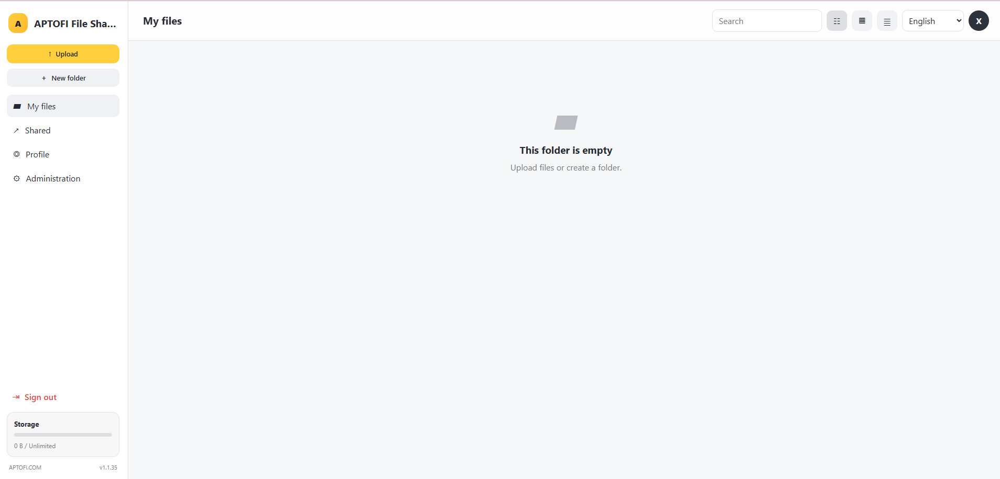
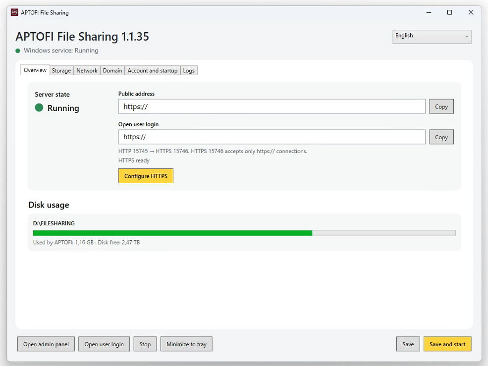
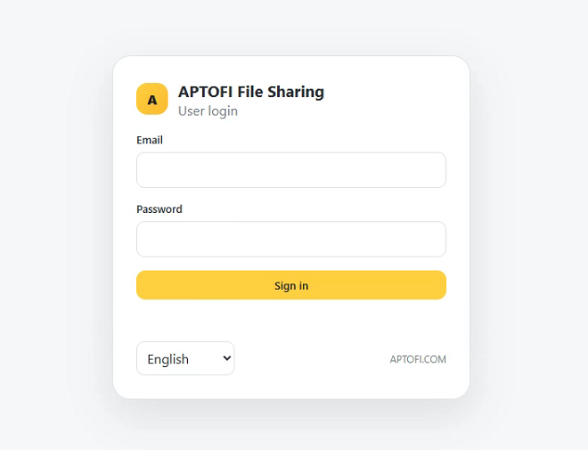

# APTOFI File Sharing 1.1.35

[English](README.md) · [Русский](docs/README.ru.md) · [Deutsch](docs/README.de.md) · [Українська](docs/README.uk.md) · [Français](docs/README.fr.md) · [Polski](docs/README.pl.md) · [Türkçe](docs/README.tr.md) · [한국어](docs/README.ko.md) · [中文](docs/README.zh.md) · [日本語](docs/README.ja.md)

**Developer:** [APTOFI.COM](https://aptofi.com)

No space left in Google Drive, OneDrive or Yandex Disk, but you have a spare HDD/SSD and a Windows PC with network access? **APTOFI File Sharing turns that PC into your own private file-sharing server.**

## Strong points

- **Your disks, your rules:** use one or several local storage locations instead of paying for cloud space.
- **Upload complete folders:** drag a folder from the desktop and APTOFI recreates the full subfolder hierarchy, including empty folders.
- **Large-file friendly:** resumable streaming uploads, bounded memory use and recovery after network interruptions.
- **Fast bulk download:** download folders or mouse-selected files/folders as one streaming ZIP64 archive without creating a temporary full archive first.
- **Multi-user:** separate accounts, quotas, last-login IP, public links and permanent user deletion with owned data cleanup.
- **Optional Trash:** disabled by default; when enabled, deleted data is retained for 30 days and still counts toward quota until permanent deletion.
- **Public sharing:** password-protected and expiring links for files and folders.
- **Internet, LAN or VPS:** run locally, expose a direct public IP/domain, or use the built-in reverse SSH tunnel mode.
- **HTTPS automation:** ACME certificate issuance with RFC2136/TSIG DNS-01 for providers that support dynamic DNS updates.
- **Windows service:** the server can start automatically before user sign-in; the control panel can live in the tray.
- **Responsive web UI:** desktop, tablet and mobile layouts; 10 interface languages.

## Requirements

Runtime: Windows 7 SP1–Windows 11 with .NET Framework 4.8. Administrative rights are required for the Windows service, HTTP.sys, firewall rules and certificate binding.

Build: Visual Studio 2022 with the **.NET Framework 4.8 Developer Pack**.

## Build

```powershell
msbuild APTOFI.FileSharing.sln /m /restore /p:Configuration=Release /p:Platform="Any CPU"
```

The executable is created under `src/APTOFI.FileSharing/bin/Release/afsharing.exe`. GitHub Actions uses the same Release build.

## First start

1. Run `afsharing.exe` as Administrator.
2. Add a storage directory, for example `D:\FileSharing`.
3. Create or verify the administrator account.
4. Change the administrator and user secret paths. Example: `/my-admin-9F3x` and `/files-k7P2`.
5. Choose the network mode.
6. Press **Save and start**.
7. Open the generated user or administrator URL.

Runtime settings, database, logs and certificates are stored beside the executable; user files are stored in the storage directories you select. Runtime secrets are excluded by `.gitignore`.

## LAN-only example

Use this when the server should work only inside your home or office network.

```text
Bind address: 0.0.0.0
Mode: Local
HTTP port: 15745
HTTPS: optional/off for a trusted LAN
User path: /files-k7P2
```

If the server PC is `192.168.1.50`, open:

```text
http://192.168.1.50:15745/files-k7P2
```

Allow the configured port through Windows Firewall if needed. No domain is required.

## Direct public IP example

Forward the configured TCP port from your router to the Windows server and use **Direct** mode. A raw public-IP HTTP deployment is technically possible if HTTPS is disabled, but it is **not recommended** for private files and passwords. For Internet access, prefer a domain with HTTPS or VPS/tunnel mode.

If your ISP uses CGNAT and you cannot forward inbound ports, use the VPS/tunnel mode instead.

## Domain + HTTPS example

Example with an RFC2136/TSIG-capable DNS provider:

```text
Mode: Direct
Domain: files.example.net
HTTPS port: 15746
DNS mode: RFC2136 / TSIG
DNS update server: ns1.example.net
DNS zone: files.example.net
TSIG key name: your-key-name
TSIG algorithm: HMAC-SHA256
TSIG secret: your-provider-secret
Automatic A update: enabled
Certificate email: admin@example.net
CA terms: accepted
```

Then save the settings, test DNS, issue/configure HTTPS and forward TCP `15746` from the router to the server. With DNS-01, public TCP 80/443 is not required for certificate validation.

### dynv6 example

For a dynv6 zone such as `myfiles.dynv6.net`, a typical setup is:

```text
Domain: myfiles.dynv6.net
DNS update server: ns1.dynv6.com
DNS zone: myfiles.dynv6.net
TSIG algorithm: HMAC-SHA256
TSIG key name / secret: create them in your dynv6 account
```

Do not commit the TSIG secret to Git.

## VPS / tunnel example

Use this when the Windows PC is behind CGNAT or you do not want inbound router forwarding. Configure an Ubuntu/Debian VPS in **VPS / tunnel** mode with its SSH host, port, user and password/private key, remote tunnel port and public domain. APTOFI can configure and maintain a reconnecting reverse SSH tunnel.

```text
VPS host: 203.0.113.20
SSH port: 22
SSH user: aptofi
Remote tunnel port: 18080
VPS domain: files.example.net
```

## Typical use

- Drag individual files or whole folder trees into the browser.
- Use **Properties** to download, rename, delete or move an item.
- Select files with the mouse and use right-click to download the selection as one ZIP archive.
- Create public links with optional password and expiration.
- Configure personal/server/storage quotas in Administration.
- Enable Trash only if you want 30-day recovery; files in Trash still use real quota.

## Repository safety

Do not commit `afsharing.settings`, databases, logs, TSIG secrets, SSH keys, certificate private keys or runtime branding. The repository `.gitignore` excludes these runtime artifacts.

Project attribution is explicit and documented: **APTOFI.COM — https://aptofi.com**.

## Screenshots

### Web interface

A clean responsive browser interface for files, folders, sharing and administration. Works on desktop, tablet and mobile devices.



### Windows control panel

The Windows application manages storage, network access, domains, HTTPS, the Windows service and server startup from one place.



### Secure user login

Separate protected entry points can be configured for users and administrators. The interface and authentication page support all built-in languages.



## License

Use, modification and redistribution are allowed under the included **APTOFI Attribution License 1.0**. Attribution to **APTOFI.COM** with the link **https://aptofi.com** is mandatory.

See [CHANGELOG.md](CHANGELOG.md) for release history.
